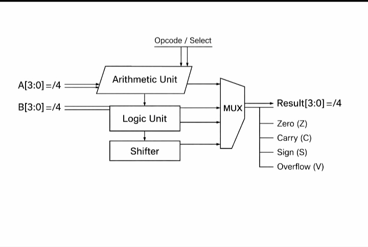

# 🔢 4-Bit ALU Design Using Verilog HDL

## 📌 Overview
This project implements a **4-bit Arithmetic Logic Unit (ALU)** using **Verilog HDL** with a clean and modular RTL design.  
The ALU supports **16 operations**, including arithmetic, logical, shift, rotate, and comparison functions.  
Functional verification is performed using **Icarus Verilog**, **VCD waveform generation**, and **GTKWave** analysis.

---

## 🧠 ALU Architecture


---

## ⚙️ Supported Operations

| Opcode | Operation |
|------|-----------|
| 0000 | Addition |
| 0001 | Subtraction |
| 0010 | Multiplication |
| 0011 | Increment |
| 0100 | AND |
| 0101 | OR |
| 0110 | XOR |
| 0111 | NOR |
| 1000 | NOT |
| 1001 | Logical Left Shift |
| 1010 | Logical Right Shift |
| 1011 | Rotate Left |
| 1100 | Rotate Right |
| 1101 | Greater Than |
| 1110 | Equal To |

---

## 🚩 Status Flags
- **Carry Flag (C)** – Indicates carry-out from arithmetic operations  
- **Zero Flag (Z)** – Asserted when the result is zero  
- **Negative Flag (N)** – Indicates MSB = 1 (signed result)

---

## 🧪 Simulation & Verification

### Tools Used
- **Verilog HDL**
- **Icarus Verilog**
- **GTKWave**

### Simulation Commands
```bash
# Compile the ALU design and testbench
iverilog -o alu_sim src/alu_4bit.v tb/alu_4bit_tb.v

# Run simulation and generate VCD file
vvp alu_sim

# View waveform using GTKWave
gtkwave 4bit_alu.vcd
